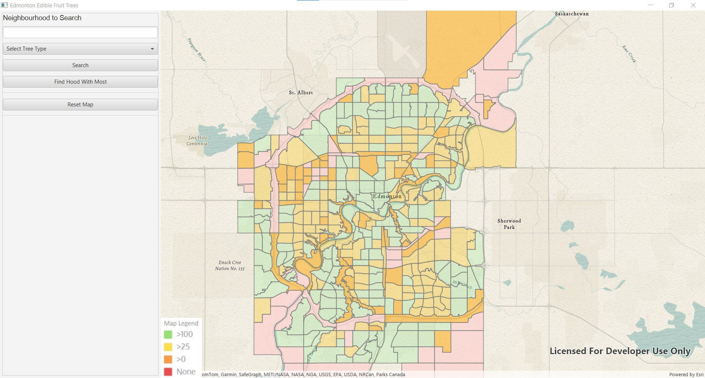
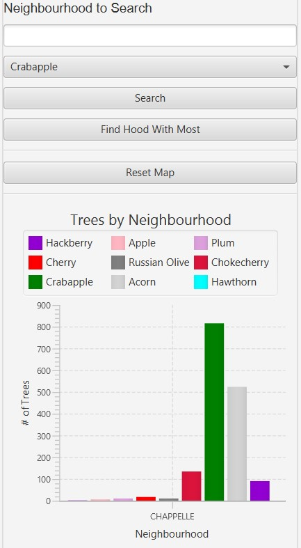
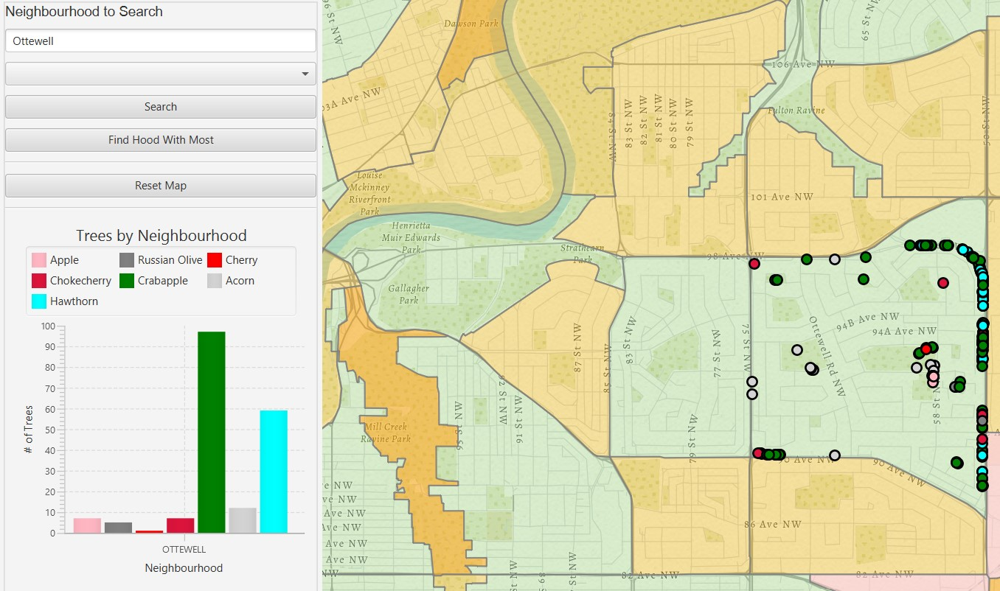
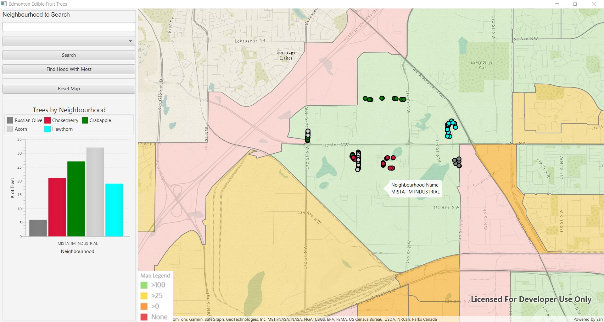

# 🌳 EdmFruitTrees

  

## About the App

**EdmFruitTrees** is an interactive Java desktop application that helps you explore fruit trees across Edmonton. You can view detailed information about different types of trees, locate them across neighborhoods, and search by area or species. It's a simple tool with powerful visual insights — built with Java and JavaFX.

---

## 🧭 Features

- 🌐 Interactive city map with fruit tree locations  
- 🔍 Neighborhood search and tree filtering  
- 🍏 Detailed view of selected trees and species  
- 💡 Built using Java, JavaFX, and public data

---

## 📸 Screenshots

  

  

  

---
